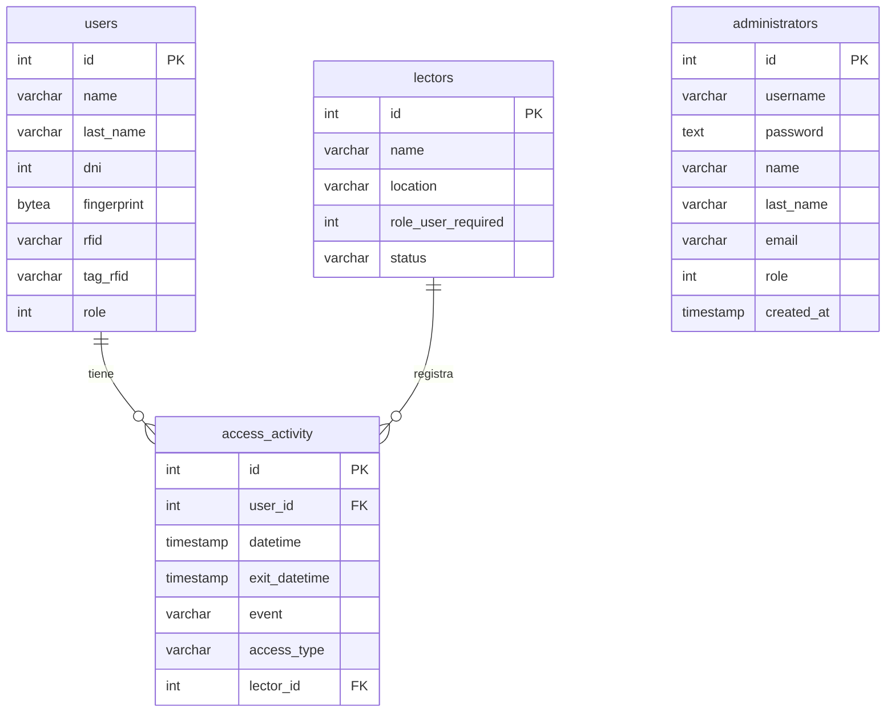

# Dashboard Web CAIMAX

## Descripción
El Dashboard Web de CAIMAX es la interfaz de usuario para gestionar y monitorear el sistema de seguridad biométrico basado en un sensor de huellas dactilares integrado con un microcontrolador ESP32. Este dashboard permite a los usuarios administrar las configuraciones del sistema, registrar nuevas huellas dactilares, y visualizar registros de acceso.

## Presentación
Se realizó la presentación del examen final en: [Prezi](https://prezi.com/view/bhEy7sDEKb0derFWj4i1/)

## Estructura de la Base de Datos
El sistema utiliza una base de datos PostgreSQL con la siguiente estructura relacional:



### Descripción de las Tablas
- **users**: Almacena la información de los usuarios, incluyendo datos personales y biométricos (huella dactilar, RFID).
- **access_activity**: Registra todos los eventos de acceso, incluyendo entrada/salida y tipo de autenticación utilizada.
- **administrators**: Gestiona las credenciales y permisos de los administradores del sistema.
- **lectors**: Contiene la información de los dispositivos lectores biométricos instalados.

## Características
- **Registro de Usuarios:** Permite agregar nuevas huellas dactilares al sistema.
- **Visualización de Accesos:** Muestra un historial de todos los accesos permitidos y denegados.

## Tecnologías Utilizadas
- **Controladores:** esp32 y Raspberry Pi.
- **Sensor de autenticación:** Sensor de huella R305.
- **Visualización:** Pantalla LCD
- **Dashboard web:** NextJS y Tailwind
- **Base de Datos:** PostgreSQL

## Instalación
1. Clonar el repositorio:
   ```bash
   git clone https://github.com/fergim92/CAIMAX
   ```
2. Instalar dependencias:
   ```bash
   cd CAIMAX/project-caimax
   npm install
   ```
3. Configurar variables de entorno:
   - Copiar el archivo `.env.example` a `.env`
   - Editar el archivo `.env` con los detalles apropiados

4. Iniciar el servidor:
   ```bash
   npm run dev
   ```

## Uso
Accede al dashboard mediante un navegador web introduciendo la URL local:
```
http://localhost:3000
```

## Contribuciones
Se aceptan contribuciones al proyecto. Para contribuir, por favor abre un pull request con tus cambios propuestos.

## Licencia
Este proyecto está licenciado bajo la Licencia MIT - ver el archivo [LICENSE.md](LICENSE.md) para más detalles.

## Contacto

- **Desarrollador:** Boyé Mauricio
- **Correo Electrónico:** mauriboye@gmail.com
- **GitHub:** [MauriBoye](https://github.com/MauriBoye)

- **Desarrollador:** Gimenez Fernando
- **Correo Electrónico:** gimenezfernandomarcos@gmail.com 
- **GitHub:** [fergim92](https://github.com/fergim92)


